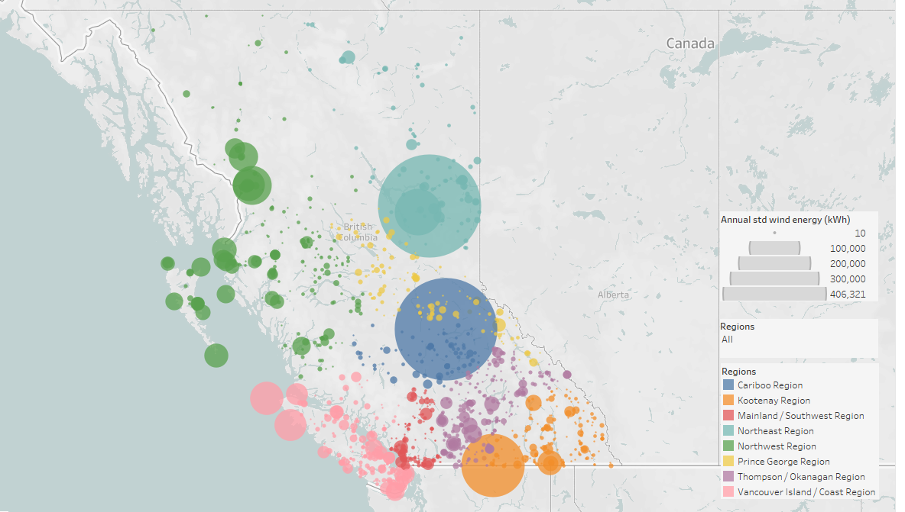

<h1 style="text-align: center;">Wind or Solar? Taking Renewable Energy Home in Any Climate.</h1>

 

## About the Project

Renewable energy is an ever-growing technology sector. As renewable energy options become more accessible to residential settings, homeowners face a decision: which form of energy production is best suited for their home?

This project used historic climate data for the province of BC, Canada to estimate annual energy production from wind or solar resources for a given region. 
Solar radiation ($W/{m^2}$) and wind speed ($m/s$) were the key variables used to calculate average solar energy produced over time (kWh) and average wind energy produced over time (kWh). 

Overall, wind and solar energy were found to have comparable average annual output.

Solar energy was found to be more consistent and the data was more uniform.
Wind energy had larger scope (more data over a longer period of time), and had wider range (max value compared to min value). 

However, to achieve a more realistic representation and reliable basis of comparison, more data must be collected and standardized.

### Tech stack:
- Python
- Pandas
- Postgres / pgAdmin 4
- Tableau

(<a href="#readme-top">back to top</a>)

## Process
### Data Acquisition
- Dataset was downloaded from the [Pacific Climate Data Consortium](https://services.pacificclimate.org/met-data-portal-pcds/app/#close)
- Weather station metadata downloaded separately

### Data cleaning and EDA
- Extract wind and solar data from weather station files
- Create a separate file for each 
- Filter for relevant columns
  - wind speed ($m/s$)
  - solar radiation ($W/{m^2}$)
- Standardize column names
  - units
  - handling whitespace
- Remove rows with null values in wind speed or solar radiation
- Remove data with observations outside of a reasonable range

### Feature engineering
- Create columns for Network ID and Station ID
- Create calculated columns for wind energy and solar energy
- Calculate daily averages for each weather station
- Calculate annual averages for each weather station
- Assign weather stations to regional groups (ignoring network provider)

### Creating visualizations
- Weather station mapping
  - Distribution
  - Observation frequency
  - Calculated energy production over time
- Regional energy production
  - Calculated energy production over time
  - Predicted energy production over time

(<a href="#readme-top">back to top</a>)

## Results

The results of this project are primarily descriptive, and are intended to lay the groundwork for more detailed and comprehensive data. 

Key insights relate to average energy production over time, energy production by energy source, and regional trends.

(<a href="#readme-top">back to top</a>)

## Challenges 

- Integrating data from 10 distinct weather station networks posed several challenges. Normalizing measurement units, variable names, observation frequencies, and date ranges were all elements that needed significant effort.
- The size of the dataset limited the efficiency of any data transformations. Memory limitations inherent to Pandas as well as computer processing ability made for very incremental cleaning and EDA.
- Large gaps in weather station locations leads to a lack of detailed analysis in remote regions (which are arguably the most relevant target group for homeowners looking for renewable, off-grid energy solutions).

(<a href="#readme-top">back to top</a>)

## Future Goals

- Combine data from other weather resources to improve location coverage.
- Improve consistency in the sample sizes used to calculate energy at a given time.
- Incorporate functions capable of handling dynamic variables instead of set values.
  - number of solar panels
  - solar panel efficiency
  - wind turbine blade length
  - air density (which is itself dependent on air temperature, air pressure, relative humidity, and elevation) 
- Explore Tableau/Python integration (TabPy).
  - Access Tableau calculated fields and LOD expressions with Python libraries.
  - Visualize more complex modeling results in Tableau.
- Develop regression model (decision tree) that uses a target energy production threshold to recommend whether wind, solar, both, or neither are capable of meeting that threshold.
- Create a user interface that allows a client to input their location and receive results based on data from the nearest weather station(s).

(<a href="#readme-top">back to top</a>)

