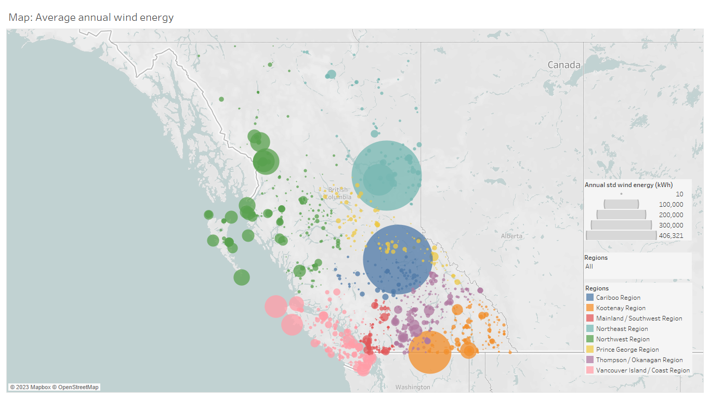

<!-- PROJECT LOGO -->
 

  

<h1 align="center">Wind or Solar?</h3>

  

    Taking Renewable Energy Home in Any Climate.
  

<!-- TABLE OF CONTENTS -->

  
Table of Contents

  <ol>
    <li>
      <a href="#about-the-project">About The Project</a>
      <ul>
        <li><a href="#key-findings">Key Findings</a></li>
        <li><a href="#data-considerations">Data Considerations</a></li>
        <li><a href="#tech-stack">Tech Stack</a></li>
      </ul>
    </li>
    <li>
      <a href="#process">Process</a>
      <ul>
        <li><a href="#data-acquisition">Data Acquisition</a></li>
        <li><a href="#data-cleaning-and-eda">Data Cleaning and EDA</a></li>
        <li><a href="feature-engineering">Feature Engineering</li>
        <li><a href="visualizations-and-forecasting">Visualizations and Forecasting< /li>
      </ul>
    </li>
    <li><a href="#results">Results</a></li>
    <li><a href="#challenges">Challenges</a></li>
    <li><a href="#future-goals">Future Goals</a></li>
  </ol>

<!-- ABOUT THE PROJECT -->
## About the Project

Renewable energy is an ever-growing technology sector. As renewable energy options become more accessible to residential settings, homeowners face a decision: which form of energy production is best suited for their home?

This project used historic climate data for the province of BC, Canada to estimate annual energy production potential from wind or solar resources for a given region. 
Solar radiation ($W/{m^2}$) and wind speed ($m/s$) were the key variables used to calculate average solar energy produced over time (kWh) and average wind energy produced over time (kWh). 

<!-- KEY FINDINGS -->
### Key Findings
Overall, wind and solar energy were found to have comparable maximum values for annual energy generation potential.

The region with the highest wind energy potential was the Cariboo region (2,942 kWh / year). The region with the lowest wind energy potential was the Prince George region (470 kWh / year).

The region with the highest solar energy potential was the Northeast region (2,819 kWh / year). The region with the lowest solar energy potential was the Vancouver Island / Coastal region (1,843 kWh / year).

Although both wind and solar energy potential demonstrated highly seasonal trends, both were predicted to produce consistent annual averages over time for a given region.

<!-- DATA CONSIDERATIONS -->
### Data considerations: 
- Wind data included a larger number of observations from a higher number of weather stations, and all regions were represented.
- Solar data had fewer observations from a smaller number of weather stations, and not all regions were represented.
- Wind energy had larger timescale (more data over a longer period of time), and had wider range between the maximum values and the minimum values. 

To achieve a more realistic representation of energy production potential and provide a more reliable basis of comparison, more data must be collected and standardized.

<!-- TECH STACK -->
### Tech stack:
- Python
- Pandas
- Postgres / pgAdmin 4
- Tableau

(<a href="#readme-top">back to top</a>)

<!-- PROCESS -->
## Process
<!-- DATA ACQUISITION -->
### Data Acquisition
- Dataset was downloaded from the [Pacific Climate Data Consortium](https://services.pacificclimate.org/met-data-portal-pcds/app/#close)
  - Navigate to the "Station Data" tab
  - Select "CSV/ASCII" as output format
  - Select "Download Timeseries"
- Weather station metadata downloaded separately
  - Navigate to the "Station Metadata" tab
  - Keep "By History" selected
  - Select "Download Metadata"

<!-- DATA CLEANING AND EDA -->
### Data cleaning and EDA
- Extract wind and solar data from weather station files
- Create a separate file for each 
- Filter for relevant columns
  - wind speed ($m/s$)
  - solar radiation ($W/{m^2}$)
- Standardize column names
  - units
  - handling whitespace
- Remove rows with null values in wind speed or solar radiation
- Remove data with observations outside of a reasonable range

<!-- FEATURE ENGINEERING -->
### Feature engineering
- Create columns for Network ID and Station ID
- Create calculated columns for wind energy and solar energy
- Calculate daily averages for each weather station
- Calculate annual averages for each weather station
- Assign weather stations to regional groups (ignoring network provider)

<!-- VISUALIZATIONS AND FORECASTING -->
### Visualizations and forecasting
- Weather station mapping
  - Distribution
  - Observation frequency
  - Calculated energy production over time
- Regional energy production
  - Calculated energy production over time
  - Predicted energy production over time

(<a href="#readme-top">back to top</a>)

<!-- RESULTS -->
## Results

The results of this project are primarily descriptive, and are intended to lay the groundwork for more detailed analysis with more comprehensive data. 

Key insights relate to average energy production over time, energy production by energy source, and regional trends.

### Question 1: What is the average annual wind energy potential of each weather station?

The average annual wind energy potential of all weather stations ranged from 10 kWh to over 406,321 kWh.

The weather stations with higher wind potentials tended to be distributed near the mountains or along the coastline, which is consistent with typical wind patterns.

### Question 2: What is the average annual solar energy potential of each weather station?

The average annual solar energy potential of all weather stations ranged from 813 kWh to 3,465 kWh.

The variability of solar energy potential was much lower between stations, and no single location stood out as having significantly increased solar potential.

### Question 2: Which regions have the highest energy potential for each renewable resource?

The top three regions with the highest energy production potential were the same between wind and solar data, but had different rankings. This difference suggests that regions may be more suited to one form of energy generation than the other. To further support this hypothesis, regions such as the Prince George region had dramatic differences in their wind potential compared to their solar potential, encouraging further analysis.

### Question 3: How does the energy potential for each resource change over time? How much impact does seasonality have on each resource's energy potential?

Both wind and solar energy production potentials displayed strong seasonal patterns. However, when predicting whether future trends would remain steady or become less predictable, both wind and solar trends followed a consistent pattern, oscillating around a constant average value. Until more complex predictive models can be established, we can conclude that wind and solar energy production potentials should remain consistent over time.

(<a href="#readme-top">back to top</a>)

<!-- CHALLENGES -->
## Challenges 

- Integrating data from ten distinct weather station networks posed several challenges. Standardizing and normalizing data structures, measurement units, variable names, observation frequencies, and date ranges were all steps that required significant attention.
- The size of the dataset limited the efficiency of any data transformations. Memory limitations inherent to Pandas as well as computer processing ability made for very incremental cleaning and EDA.
- Large gaps in weather station locations means that there is a lack of detailed analysis in remote regions.

(<a href="#readme-top">back to top</a>)

<!-- FUTURE GOALS -->
## Future Goals

- Combine data from other weather resources to improve location coverage. Renewable, off-grid energy solutions are highly relevant to individuals living in remote locations, and this project's findings would be stronger if more locations were included.
- Improve consistency in the sample sizes used to calculate energy at a given time.
- Incorporate functions capable of handling dynamic variables instead of set values. For example, energy production potential calculations could include:
  - variable numbers of solar panels
  - variable solar panel efficiencies based on which product is being installed
  - different wind turbine blade lengths
  - specific values for air density (which is itself dependent on air temperature, air pressure, relative humidity, and elevation) 
- Explore Tableau/Python integration (TabPy).
  - Access Tableau calculated fields and LOD expressions with Python libraries.
  - Visualize more complex modeling results in Tableau.
- Develop regression model (decision tree) with a user interface that allows a user to input a target energy production threshold and their location. The model would then recommend whether wind, solar, both, or neither are capable of meeting that threshold.

(<a href="#readme-top">back to top</a>)

